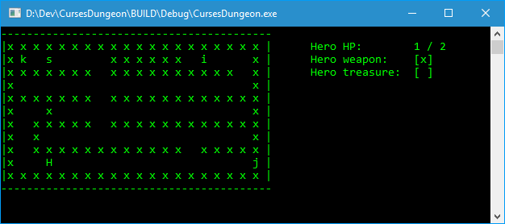

# CursesDungeon

##### Map Marks:
* "x" Wall
* "s" Monster
* "h" Hero
* "a" Sword
* "k" Treasure
* "i" Health potion
* "c" Trap
* "j" Exit

##### Player:
* Player can move hero with  UP (w), DOWN (s), RIGHT (d), LEFT (a) with the corresponding keyboard buttons.
* Player has maximum 2 health, if the health drops down to zero the hero dies and the game ends.
* The Hero can pick up items on the map (sword and potion) to reach his goals.

##### Potion:
* Heals the hero with 1 hp. can not over stack health!

##### Sword:
* pick up the sword to fight with the monsters.

##### Monsters:
* If the hero has the sword then wins against the monster but the hero loses 1 hp.
* If the hero does not have the sword with him then the monster overcomes the hero and the game ends.

##### Trap:
* If the hero triggers a trap he jumps away with great swiftness but the trap closes the way back.

##### Game Goal:
Get the Treasure and get out of the dungeon. There could be 3 way of finish a map.
* You die in the dungeon and noone ever hears about you any more.
* If you feel the stress and the darkness you can always give up and run like a little bunny. Just exit without the treasure.
* If you are brave to reach the treasure and get out of the dungeon then you win.
